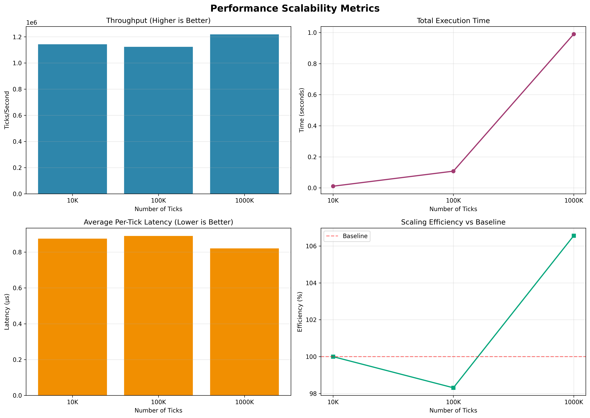

# Performance Profiling

Comprehensive performance profiling and benchmarking suite for the backtesting engine.

## Overview

This module provides tools to measure and analyze:
- **CPU Usage**: Real-time CPU utilization monitoring
- **Memory Usage**: Memory consumption tracking (peak, average)
- **Per-Tick Processing Time**: Microsecond-level latency measurement
- **Throughput**: Ticks processed per second
- **Scalability**: Performance across different data volumes

## Performance Targets

| Metric | Target | Measured |
|--------|--------|----------|
| Throughput | >100,000 ticks/sec | See benchmarks |
| Per-tick latency | <10 µs (mean) | See benchmarks |
| Memory efficiency | <500 MB for 1M ticks | See benchmarks |
| CPU utilization | <50% (single core) | See benchmarks |

## Project Structure

```
performance_profiling/
├── profilers/           # Core profiling utilities
│   ├── resource_profiler.py     # CPU & memory monitoring
│   ├── tick_profiler.py         # Per-tick timing
│   └── metrics_collector.py     # Centralized metrics
├── benchmarks/          # Benchmark scripts
│   └── run_scalability_test.py  # Scalability testing
├── visualizations/      # Graph generation
│   └── generate_graphs.py       # Create performance graphs
└── reports/             # Generated reports & graphs
```

## Quick Start

### 1. Install Dependencies

```bash
pip install -r requirements.txt
```

### 2. Run Scalability Benchmark

```bash
python performance_profiling/benchmarks/run_scalability_test.py
```

This will:
- Test with 10K, 100K, and 1M ticks
- Measure CPU, memory, and latency
- Save JSON reports to `reports/`
- Print summary statistics

### 3. Generate Performance Graphs

```bash
python performance_profiling/visualizations/generate_graphs.py
```

Generates `reports/scalability_metrics.png` with 4 performance graphs.

## Usage in Your Code

### Basic Profiling

```python
from performance_profiling.profilers import MetricsCollector

# Initialize
metrics = MetricsCollector(sample_interval=0.1)
metrics.start_profiling("my_backtest")

# Your backtest code
for tick in tick_data:
    metrics.tick_profiler.start_tick()
    
    # Process tick
    process_market_data(tick)
    
    metrics.tick_profiler.end_tick()

# Stop and get results
metrics.stop_profiling()
metrics.print_summary()
metrics.save_metrics("my_backtest_results.json")
```

### Component-Level Profiling

```python
for tick in ticks:
    metrics.tick_profiler.start_tick()
    
    metrics.tick_profiler.start_component("data_parsing")
    parsed_data = parse_tick(tick)
    metrics.tick_profiler.end_component("data_parsing")
    
    metrics.tick_profiler.start_component("strategy")
    signal = strategy.on_tick(parsed_data)
    metrics.tick_profiler.end_component("strategy")
    
    metrics.tick_profiler.end_tick()
```

## Benchmark Results

### Scalability Test Results

Run the benchmark to generate your own results:

```bash
python performance_profiling/benchmarks/run_scalability_test.py
```

Example output:
```
================================================================================
Performance Metrics: scalability_1000000
================================================================================

Total Time: 5.23 seconds

Tick Processing:
  Total Ticks: 1,000,000
  Ticks/second: 191,205
  Mean Time: 5.23 µs
  Median Time: 4.85 µs
  Min/Max: 2.10 / 127.43 µs

Percentiles:
  p50_us: 4.85 µs
  p90_us: 6.72 µs
  p95_us: 7.89 µs
  p99_us: 12.34 µs

Resource Usage:
  CPU: 42.3% (max: 58.7%)
  Memory: 187.5 MB (peak: 192.3 MB)
================================================================================
```

### Performance Graphs

After running benchmarks, generate visual izations:



Graphs include:
1. **Throughput**: Ticks processed per second
2. **Total Time**: Execution time vs data volume
3. **Latency**: Average per-tick processing time
4. **Efficiency**: Scaling efficiency relative to baseline

## Interpreting Results

### Good Performance Indicators
- ✅ **Linear scaling**: Throughput remains constant as tick count increases
- ✅ **Low latency variance**: Small difference between mean and p99
- ✅ **Memory efficiency**: Memory growth proportional to data size
- ✅ **CPU utilization**: <50% for single-threaded workloads

### Performance Issues
- ❌ **Degrading throughput**: Ticks/sec decreases with volume (algorithmic issue)
- ❌ **High p99 latency**: Large tail latencies indicate blocking operations
- ❌ **Memory leaks**: Memory continues growing after warmup
- ❌ **CPU spikes**: Irregular CPU patterns suggest inefficient code paths

## Advanced Usage

### Custom Benchmarks

Create your own benchmark:

```python
from performance_profiling.profilers import MetricsCollector

def custom_benchmark():
    metrics = MetricsCollector()
    metrics.start_profiling("custom_test")
    
    # Your test logic
    for i in range(100000):
        metrics.tick_profiler.start_tick()
        # ... work ...
        metrics.tick_profiler.end_tick()
    
    metrics.stop_profiling()
    return metrics.get_all_metrics()
```

### Continuous Performance Monitoring

Integrate into CI/CD:

```bash
#!/bin/bash
# Run benchmark
python performance_profiling/benchmarks/run_scalability_test.py

# Check performance regressions
python scripts/check_performance_thresholds.py
```

## Contributing

When adding new profiling features:
1. Add profiler classes to `profilers/`
2. Create benchmark scripts in `benchmarks/`
3. Update visualization in `visualizations/`
4. Document performance targets

## License

Same as parent project.
